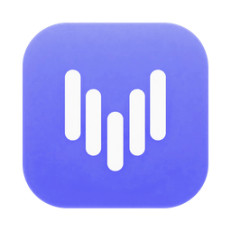
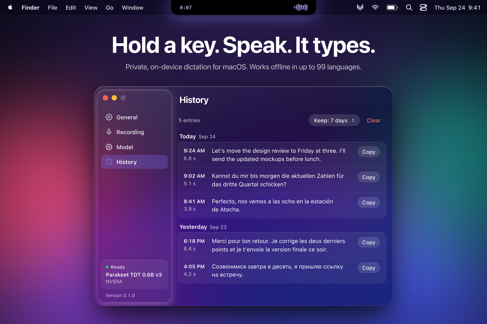
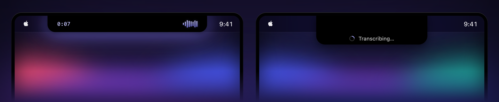
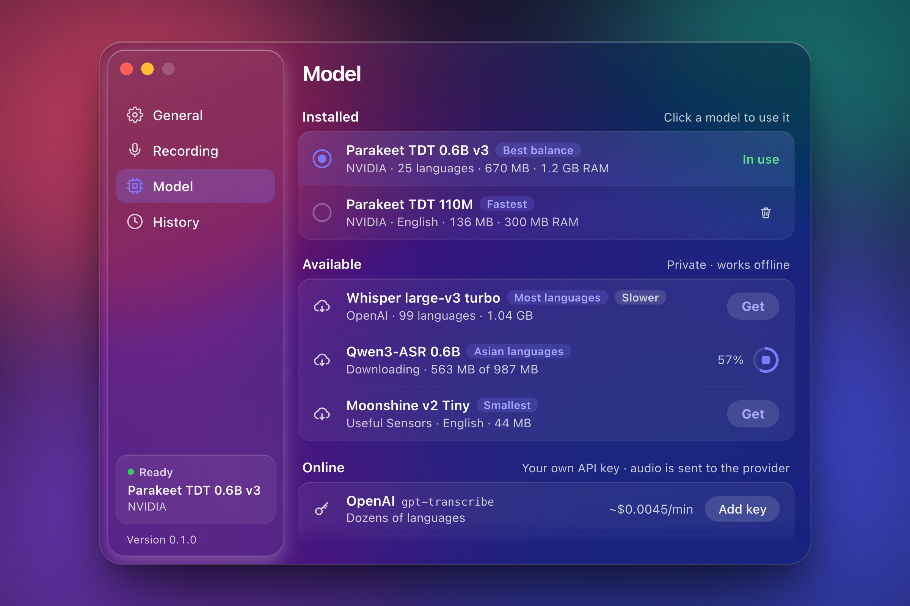
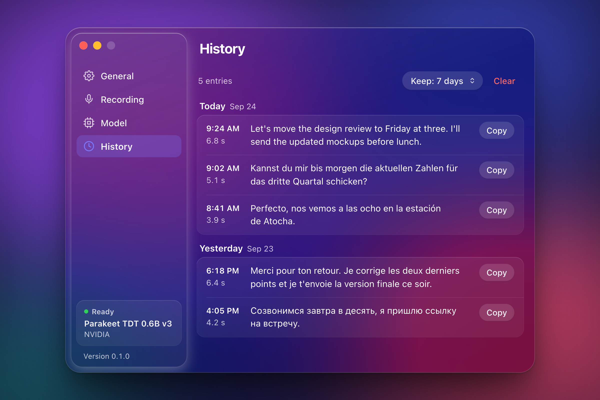
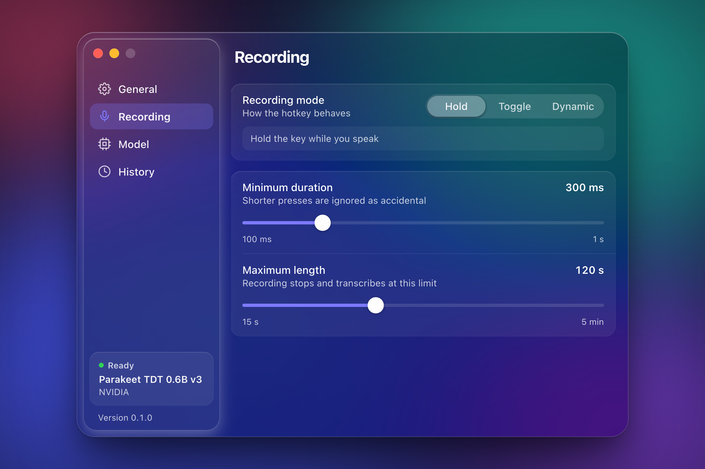
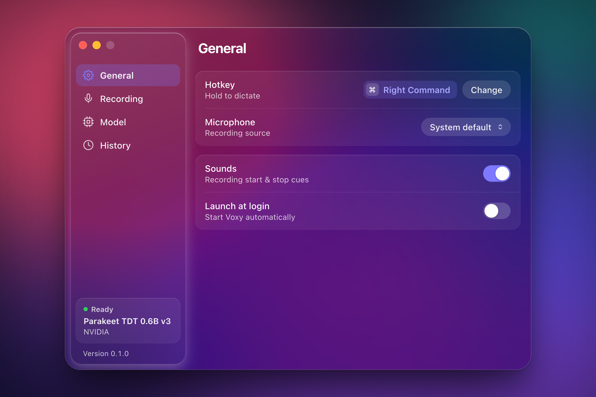

<p align="center">
  
</p>

<h1 align="center">Voxy</h1>

<p align="center">
  Push-to-talk dictation for macOS that types into any app, with speech recognition that runs on your Mac.
</p>

<p align="center">
  <a href="https://github.com/DIZRAID/voxy/actions/workflows/ci.yml"></a>
  
  
  
  
</p>

<p align="center">
  <a href="#install">Install</a> ·
  <a href="#usage">Usage</a> ·
  <a href="#models">Models</a> ·
  <a href="docs/TROUBLESHOOTING.md">Troubleshooting</a> ·
  <a href="docs/DEVELOPMENT.md">Development</a> ·
  <a href="README.ru.md">Русский</a>
</p>

<p align="center">
  
</p>

> **Early days.** Voxy is at version 0.1.0 and there are no prebuilt downloads yet, so for now you [build it from source](#build-from-source). It takes a few commands. The Windows port compiles in CI but has not been run on real hardware yet ([details](#windows)).

## Why Voxy

Speaking is often faster than typing. Voxy turns it into a single gesture: hold a key, say what you mean, let go, and the text is there, in your editor, a chat, an email or a browser tab. Recognition runs locally with open speech models through [sherpa-onnx](https://github.com/k2-fsa/sherpa-onnx), so your voice stays on your Mac and dictation keeps working offline. If you would rather use a cloud model, bring your own API key. Everything else stays out of the way: Voxy lives in the menu bar and shows up as a small island at the notch while you talk.

- **Works in any app.** Hold Right ⌘ (or any single key you pick), speak, release. The text is pasted at the cursor of whatever app is in front. Prefer to tap instead of hold? Switch to Toggle or Dynamic mode.
- **Lives at the notch.** On MacBooks with a camera notch, the island is sized to the notch and blends into it. While you record, it widens to show a timer, a live waveform and a soft glow that follows your voice. On displays without a notch, it slides down from the top of the screen only while you record.
- **Private by default.** Local models run on the CPU. Audio stays in memory and is never written to disk, and once a model is downloaded, dictation works offline. No analytics, no telemetry.
- **The right model for your language.** A built-in model manager with five local models: the default covers 25 European languages; Whisper covers 99; Qwen3-ASR adds Chinese, Japanese, Korean, Arabic and Hindi; and a 44 MB model handles English only. Models come from pinned revisions, downloads resume after interruptions, and every file is verified with SHA-256. Prefer the cloud? Use OpenAI, Groq or ElevenLabs with your own API key, kept in the macOS Keychain.
- **Long dictation, short wait.** Long recordings are cut at pauses into pieces of about 20 seconds, and each piece is transcribed while you keep talking, so the text arrives soon after you let go. Record up to 5 minutes at a time (2 minutes by default).
- **History at hand.** Your last 50 transcriptions, grouped by day, each one click away from the clipboard. Keep them for 24 hours, 7 days (the default), 30 days or forever.
- **Light on resources.** No Dock icon, just a menu bar item. The local model is unloaded after 5 minutes without use (you can pick 2, 5, 15 or 30 minutes, or Never) and reloads while you speak, so recording still starts the moment you press the key.

## A closer look

<p align="center">
  
</p>
<p align="center"><sub>The island at the notch: a timer, a live waveform and a glow while you speak, then "Transcribing…" until the text is pasted.</sub></p>

In the app, the Settings window is made of the native macOS material, so it takes on the colors of whatever is behind it. The images here are rendered from the app's UI code ([docs/marketing](docs/marketing/)); on your Mac the window uses the system material, which can look more muted.

<table>
  <tr>
    <td width="50%" valign="top">
      
      <p align="center"><sub><b>Model</b>: installed and available models, online providers</sub></p>
    </td>
    <td width="50%" valign="top">
      
      <p align="center"><sub><b>History</b>: recent transcriptions by day, one click to copy</sub></p>
    </td>
  </tr>
  <tr>
    <td width="50%" valign="top">
      
      <p align="center"><sub><b>Recording</b>: Hold, Toggle or Dynamic, minimum press, maximum length</sub></p>
    </td>
    <td width="50%" valign="top">
      
      <p align="center"><sub><b>General</b>: hotkey, microphone, sounds, launch at login</sub></p>
    </td>
  </tr>
</table>

## Models

Five local models ship in the built-in catalog ([`src-tauri/src/catalog.json`](src-tauri/src/catalog.json)). All of them are quantized sherpa-onnx exports that run on the CPU.

| Model | Label in the app | On disk | RAM (approx.) | Languages |
|---|---|---|---|---|
| **Parakeet TDT 0.6B v3** (NVIDIA), default | Best balance | 670 MB | 1.2 GB | 25 European languages, incl. Russian and Ukrainian; auto-detected |
| **Whisper large-v3 turbo** (OpenAI) | Most languages · Slower | 1.04 GB | 1.9 GB | 99 languages, auto-detected |
| **Qwen3-ASR 0.6B** (Alibaba Qwen) | Asian languages | 987 MB | 1.8 GB | 30 languages, incl. Chinese, Japanese, Korean, Arabic, Hindi |
| **Parakeet TDT 110M** (NVIDIA) | Fastest | 136 MB | 300 MB | English only |
| **Moonshine v2 Tiny** (Useful Sensors) | Smallest | 44 MB | 100 MB | English only |

**Which one?** Start with the default. If you speak a language Parakeet does not cover, pick Whisper or Qwen3-ASR. If you only dictate in English and want the smallest download, pick Parakeet TDT 110M or Moonshine v2 Tiny.

- For most models the download size equals the size on disk. Parakeet TDT 110M is the exception: it comes as a 108 MB archive and takes 136 MB once extracted.
- Each model keeps its own license: the Parakeet models are CC-BY-4.0, Whisper and Moonshine are MIT, Qwen3-ASR is Apache-2.0.
- **New models.** At startup, at most once a day, Voxy checks the sherpa-onnx model release on GitHub and lists up to five new models from families it can run, marked "Not rated yet". They are only listed, not installed. Models join the catalog in app updates, after testing.

**Online providers** (optional, each needs your own API key):

| Provider | Model | Languages (as listed in the app) | Price shown in the app |
|---|---|---|---|
| OpenAI | `gpt-transcribe` | Dozens of languages | ~$0.0045/min |
| Groq | `whisper-large-v3-turbo` | 99 languages | ~$0.00067/min |
| ElevenLabs | `scribe_v2` | 90+ languages | ~$0.0037/min |

Prices are the app's estimates as of September 2026. Billing is between you and the provider.

## Privacy

- **Local models:** audio never leaves your Mac. It is held in memory only while it is recorded and transcribed. Voxy never writes audio to disk.
- **Online providers:** audio goes only to the provider you selected. It is sent as 16 kHz mono WAV, in pieces of up to 28 seconds.
- **API keys** are stored only in the macOS Keychain (Credential Manager on Windows). After you save a key, the app never sends it back to the Settings window; it only reports whether a key exists. Before saving, Voxy checks the key with a request that does not use any transcription minutes.
- **History** is plain text in `history.json` on your machine (see [Data locations](docs/TROUBLESHOOTING.md#data-locations)). It is kept for the period you choose, and the Clear button deletes it.
- **Clipboard:** pasting works through the clipboard, so the dictated text sits there briefly. If the clipboard held text before, that text is put back about 0.5 s later. Clipboard history tools may still record the dictated text.
- **Other network requests:** model downloads (Hugging Face and GitHub) and the once-a-day check for new models (GitHub API). That's all.

## Install

### Requirements

- macOS 14 Sonoma or later.
- A Mac with Apple Silicon is recommended. Voxy is developed and tested on Apple Silicon; Intel Macs have not been tested.
- Disk space and memory for at least one model: 44 MB to 1.04 GB on disk (see [Models](#models)). The default model takes 670 MB on disk and about 1.2 GB of RAM.
- For building: a few GB of free disk space in `src-tauri/target`.

### Build from source

Prebuilt downloads are on the way (see [Roadmap](#roadmap)). Until then, you need three things:

1. Xcode Command Line Tools: `xcode-select --install`
2. Rust 1.88 or newer from [rustup.rs](https://rustup.rs). If Rust is already installed, run `rustup update stable`.
3. Tauri CLI v2:
   ```sh
   cargo install tauri-cli --version "^2.0.0" --locked
   ```

Node.js and npm are not needed: the UI in `ui/` is plain HTML, CSS and JavaScript with no build step.

Build Voxy and copy it to `/Applications`:

```sh
git clone https://github.com/DIZRAID/voxy.git
cd voxy/src-tauri
cargo tauri build
cp -R target/release/bundle/macos/Voxy.app /Applications/
open /Applications/Voxy.app
```

Good to know:

- The first build downloads a prebuilt static sherpa-onnx library (with ONNX Runtime, about 20 MB) from the sherpa-onnx GitHub releases. If that download fails, see [Troubleshooting](docs/TROUBLESHOOTING.md#the-build-fails-while-downloading-sherpa-onnx).
- Release builds use full LTO, so the final link step takes a while.
- Debug builds from `cargo tauri dev` and `cargo test` take more disk space on top of the release build. `cargo clean` (run in `src-tauri/`) frees it.
- **Gatekeeper.** A build you make on your own Mac opens normally. Builds are not notarized, though, so a copy downloaded from the internet is blocked the first time you open it. On macOS 14, Control-click (right-click) the app, choose Open, then confirm. On macOS 15 and later, try to open the app once, then go to System Settings → Privacy & Security and click Open Anyway.

### Updating to a new build

Quit the running Voxy first (menu bar icon → Quit Voxy). Only one copy of Voxy can run, so while the old one is running, the new build does not start. Delete the old `/Applications/Voxy.app`, copy the new one and open it. Then re-grant two permissions (see [After a rebuild](#after-a-rebuild)).

## First launch and permissions

### First launch

1. Voxy's icon appears in the menu bar. Its menu has Settings… and Quit Voxy. If you can't see the icon (on a MacBook with a notch, a full menu bar can hide it), open Voxy again from `/Applications` to bring up Settings.
2. macOS asks for Accessibility and Input Monitoring. The Settings window opens with a banner that shows which permissions are still missing.
3. If no model is installed yet, the default Parakeet TDT 0.6B v3 (670 MB) starts downloading. Progress appears in Settings → Model. For other languages, or for a smaller download, stop the running download with the round button next to its progress, click Get next to the model you want, then click that model under Installed when it finishes. Downloading a model does not switch to it.
4. macOS asks for microphone access the first time you record. Click Allow, then dictate again.

### Permissions

macOS: System Settings → Privacy & Security.

| Permission | What it is used for |
|---|---|
| Accessibility | Pasting: sends ⌘V to the active app |
| Input Monitoring | The global hotkey. Voxy uses a listen-only event tap, so keystrokes are observed but never blocked or changed |
| Microphone | Recording; macOS asks the first time you record |

The hotkey starts working once both Accessibility and Input Monitoring are granted. You do not need to restart Voxy, because it checks every 2 seconds. The button in the Settings banner opens the System Settings page for the next missing permission: Accessibility first, then Input Monitoring.

### After a rebuild

Builds are ad-hoc signed, so every new build has a different code signature. macOS keeps the old Accessibility and Input Monitoring entries, but they no longer match the new build: the switch still looks on, yet the permission does not work.

The quickest fix is to reset both entries from Terminal (`com.dizraid.voice` is Voxy's bundle identifier, and `ListenEvent` is the system name for Input Monitoring):

```sh
# Quit Voxy first (menu bar icon → Quit Voxy)
tccutil reset Accessibility com.dizraid.voice
tccutil reset ListenEvent com.dizraid.voice
open /Applications/Voxy.app
```

Voxy asks for both permissions again when it starts; switch it on in both lists. If you prefer System Settings, quit Voxy, select it in each of the two lists and remove it with the − button, then open the new build and grant the permissions (or add the app back with +).

For the same reason, macOS may ask whether Voxy can read a saved API key from the Keychain. Choose Always Allow.

When you run Voxy with `cargo tauri dev`, macOS checks the permissions of the terminal app that started it (Terminal, iTerm and so on). Grant the permissions to that terminal app.

## Usage

1. Put the cursor in any text field.
2. Hold Right ⌘ and speak.
3. Release. The island shows "Transcribing…", then the text is pasted.

| Mode | Behavior |
|---|---|
| Hold (default) | Records while the key is held; releasing it transcribes |
| Toggle | Press once to start, press again to stop |
| Dynamic | A quick tap (under 1 s) starts a recording that continues until the next press. Holding for 1 s or longer works like Hold |

- **Cancel a recording:** click the island while it is recording, then click the Cancel button that appears. The audio is discarded.
- **Accidental taps:** presses shorter than the minimum duration (Settings → Recording, default 300 ms) are ignored.
- **Length limit:** when the maximum length is reached (Settings → Recording, 15 s to 5 min, default 120 s), the recording stops and is transcribed. The timer turns yellow 10 seconds before the limit and red 5 seconds before it.
- **Change the hotkey:** Settings → General → Hotkey → Change, then press the new key (Esc cancels). Voxy observes the key without blocking it, so the key still reaches the active app. A modifier or an unused function key works best.
- **Delete a model:** click the trash icon next to it in Settings → Model.
- **Other settings:** microphone, start and stop sounds, and launch at login in General; when to free the model's memory in Model.
- **Open Settings:** menu bar icon → Settings…, or launch Voxy again.
- **History:** Settings → History lists recent transcriptions, each with a Copy button. The Keep menu sets how long entries are kept, and Clear deletes them all.
- **Clipboard:** if the clipboard held text before a paste, that text is restored afterwards. Other content, such as an image, is not restored.

The island also shows short messages when something goes wrong. [Troubleshooting](docs/TROUBLESHOOTING.md#messages-on-the-island) explains what they mean.

## Windows

A Windows 10/11 (x64) port is written: a low-level keyboard hook for the hotkey (Right Ctrl by default, no permissions needed), pasting with Ctrl+V that works with any keyboard layout, and an island that slides down from the top of the screen. CI builds it and compiles the unit tests on `windows-latest`, which shows that the code compiles and links, not that the app works. It has never been run on real hardware, so expect rough edges.

Build steps, the differences from macOS and a testing checklist are in [BUILD_WINDOWS.md](BUILD_WINDOWS.md). Reports from Windows users are very welcome.

## Roadmap

- **Signed and notarized macOS releases**, so you can download Voxy instead of building it.
- **More local models**, added to the catalog after testing.
- **Windows**: testing on real hardware and fixing what turns up.
- **A light theme** for the Settings window.

## Documentation

- [docs/DEVELOPMENT.md](docs/DEVELOPMENT.md): running from source, tests, previewing the UI without Tauri, adding a model, project layout and stack.
- [docs/TROUBLESHOOTING.md](docs/TROUBLESHOOTING.md): logs, island messages, hotkey and paste problems, model downloads, build issues, data locations and uninstalling.
- [BUILD_WINDOWS.md](BUILD_WINDOWS.md): building and testing on Windows.

## Acknowledgements

- [sherpa-onnx](https://github.com/k2-fsa/sherpa-onnx) by the k2-fsa team runs every local model in Voxy.
- [NVIDIA Parakeet](https://huggingface.co/nvidia/parakeet-tdt-0.6b-v3) powers the default model. Thanks also to the authors of [Whisper](https://huggingface.co/openai/whisper-large-v3-turbo) (OpenAI), [Qwen3-ASR](https://huggingface.co/Qwen/Qwen3-ASR-0.6B) (Alibaba Qwen) and [Moonshine](https://huggingface.co/UsefulSensors/moonshine) (Useful Sensors).
- [Tauri](https://tauri.app) for the app shell. The main Rust crates Voxy builds on are listed in [docs/DEVELOPMENT.md](docs/DEVELOPMENT.md#stack).
- Some Settings tab icons are adapted from [Feather Icons](https://feathericons.com) (MIT, © Cole Bemis).

## License

Voxy does not have a license yet. The speech models are distributed under their own licenses (see [Models](#models)).
